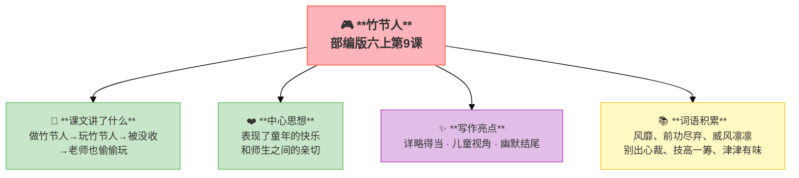

---
tags:
  - 六上
  - 语文
  - 阅读策略
  - 记叙文
  - 竹节人
---

# 第09课 竹节人

> 部编版六上第3单元 · 阅读策略：有目的地阅读
> **阅读重点**：根据阅读目的选用恰当的阅读方法
> **习作目标**：____让生活更美好（议论文雏形）

---

## 📖 课文讲了什么

"我们"小时候自己用毛笔杆做竹节人——用线一拉，竹节人就挥舞着武器打起来。课上玩被老师没收了，但老师自己也玩得津津有味。



---

## ❤️ 中心思想

**回忆了童年时代做竹节人、玩竹节人以及老师没收竹节人却自己也玩的故事，表现了童年的快乐和师生之间的亲切。**

---

## 📜 知背景

- 作者：范锡林
- 这是一个关于**童年DIY乐趣**的故事

---

## 📝 生字

（本课无重点生字）

---

## 🔤 多音字

（本课无重点多音字）

---

## 📚 词语积累

| 词语 | 解释 |
|:----|:-----|
| **风靡** | 草木随风倒下（比喻流行） |
| **前功尽弃** | 以前的努力全白费了 |
| **威风凛凛** | 气势威严 |
| **别出心裁** | 独创一格 |
| **技高一筹** | 本领高一些 |
| **弄巧成拙** | 想卖弄反而办了蠢事 |
| **虎视眈眈** | 贪婪地盯着 |
| **津津有味** | 很有兴趣 |

---

## 🏗️ 文章结构：超清晰！

```
做竹节人（制作方法——毛笔杆、线）
    ↓
玩竹节人（课间对战——像古代的武士）
    ↓
课上被没收（老师把竹节人没收了）
    ↓
意外之喜（老师自己也偷偷玩）
```

---

## ✨ 阅读与写作：深挖课文"宝藏"

| 写法亮点 | 课文内容 | 写作技巧 |
|:---------|:---------|:---------|
| **详略得当** | 制作方法详写，其他略写 | 根据阅读目的选择详略 |
| **儿童视角** | "那段时间，妈妈总是不解地问……" | 用孩子的口吻讲故事 |
| **幽默结尾** | 老师也玩竹节人——"双手在抽屉里扯着线" | 反转趣味，令人回味 |

---

## 📚 语言积累：词语库+句式库

### 句式库
- 那段时间，妈妈总是不解地问……

---

## 📋 学习自评表

| 评价维度 | 我能…… | ⭐⭐⭐ |
|:---------|:-------|:------|
| **读** | 读出竹节人的乐趣 | □ |
| **说** | 说出不同的阅读目的和读法 | □ |
| **讲** | 能给同学讲竹节人的故事 | □ |
