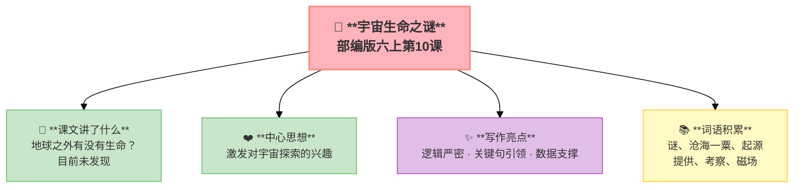

---
tags:
  - 六上
  - 语文
  - 阅读策略
  - 说明文
  - 宇宙生命之谜
---

# 第10课 宇宙生命之谜

> 部编版六上第3单元 · 阅读策略：有目的地阅读
> **阅读重点**：根据阅读目的选用恰当的阅读方法
> **习作目标**：____让生活更美好（议论文雏形）

---

## 📖 课文讲了什么

| 核心问题 | 主要内容 |
|:---------|:---------|
| 地球之外有没有生命？ | 理论分析→考察火星→目前没有发现 |

**一句话速览**：科学家分析生命需要水、空气、温度——火星最像地球，但探测发现它表面没有液态水、大气稀薄、温度极低。目前为止，没有发现地外生命。



---

## ❤️ 中心思想

**激发对宇宙探索的兴趣——目前没有发现地外生命，但探索永不止步。**

---

## 📜 知背景

- 这是一篇**科普说明文**
- 按"提出问题→分析条件→考察论证→得出结论"的结构组织

---

## 📝 生字

（本课无重点生字）

---

## 🔤 多音字

（本课无重点多音字）

---

## 📚 词语积累

| 词语 | 解释 |
|:----|:-----|
| **谜** | 没弄明白的问题 |
| **沧海一粟** | 大海中的一粒米（比喻非常渺小） |
| **起源** | 开始发生 |
| **提供** | 供给 |
| **考察** | 调查观察 |
| **磁场** | 磁力作用的空间 |

---

## 🏗️ 文章结构：超清晰！

```
提出问题（地球之外有生命吗）
    ↓
理论分析（生命需要什么条件——水、空气、温度）
    ↓
重点考察（火星最像地球——重点研究）
    ↓
探测结论（火星表面无水、大气稀薄、温度极低→目前未发现）
```

---

## ✨ 阅读与写作：深挖课文"宝藏"

| 写法亮点 | 课文内容 | 写作技巧 |
|:---------|:---------|:---------|
| **逻辑严密** | 条件分析→排除法→聚焦火星 | 层层推进，科学严谨 |
| **关键句引领** | "地球之外是否有生命存在，是人类一直探索的宇宙之谜" | 首段抛出问题，统领全文 |
| **数据支撑** | 火星温度、大气数据 | 用数字说话，更有说服力 |

---

## 📚 语言积累：词语库+句式库

### 句式库
- 地球之外是否有生命存在，是人类一直探索的宇宙之谜。

---

## 📋 学习自评表

| 评价维度 | 我能…… | ⭐⭐⭐ |
|:---------|:-------|:------|
| **读** | 快速找到火星不适合生命的原因 | □ |
| **说** | 说出生命需要的三个条件 | □ |
| **理** | 理清文章的论证思路 | □ |
