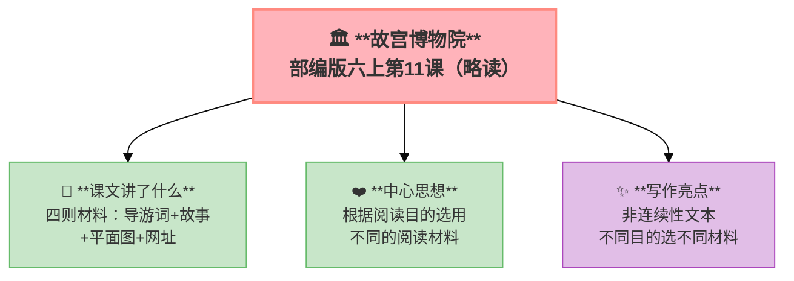

---
tags:
  - 六上
  - 语文
  - 阅读策略
  - 说明文
  - 故宫博物院
---

# 第11课 故宫博物院（略读）

> 部编版六上第3单元 · 阅读策略：有目的地阅读
> **阅读重点**：根据阅读目的选用恰当的阅读方法
> **习作目标**：____让生活更美好（议论文雏形）

---

## 📖 课文讲了什么

| 核心问题 | 主要内容 |
|:---------|:---------|
| 故宫是什么样的？不同材料有什么作用？ | 四则材料——导游词＋故事＋平面图＋网址 |

**一句话速览**：四则材料：材料一是故宫导游词（由南到北介绍），材料二是太和门故事，材料三是故宫平面图，材料四是网址。

---

## ❤️ 中心思想

**根据阅读目的选用不同的阅读材料——非连续性文本的阅读方法。**

---

## 📝 生字

（本课无重点生字）

---

## 🔤 多音字

（本课无重点多音字）

---

## 📚 词语积累

（本课为略读课文，无重点词语）

---

## 🏗️ 文章结构：超清晰！

（非连续性文本——四则材料各自独立：导游词+故事+平面图+网址）

---

## ✨ 阅读与写作：深挖课文"宝藏"

| 写法亮点 | 课文内容 | 写作技巧 |
|:---------|:---------|:---------|
| **非连续性文本** | 文字+图片+图表+网址 | 多种形式呈现信息 |
| **不同目的选不同材料** | 想了解布局→材料一；想找出口→材料三 | 有目的地阅读 |

---

## 📚 语言积累：词语库+句式库

（本课为非连续性文本，无重点句式）

---

## 📋 学习自评表

| 评价维度 | 我能…… | ⭐⭐⭐ |
|:---------|:-------|:------|
| **读** | 根据目的选择阅读材料 | □ |
| **看** | 看懂平面图等非连续性文本 | □ |
| **用** | 用多种材料获取信息 | □ |
