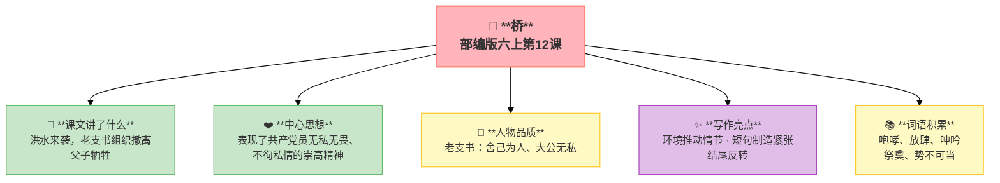

---
tags:
  - 六上
  - 语文
  - 小说
  - 叙事
  - 人物
  - 桥
---

# 第12课 桥

> 部编版六上第4单元 · 小说
> **阅读重点**：读小说，关注情节、环境、人物形象
> **习作目标**：笔尖流出的故事（创编小说）

---

## 📖 课文讲了什么

洪水来袭，老支书组织村民从唯一的小桥上撤离。他要求党员排在最后——挤在队伍里的儿子也被他揪出来。最后只剩他和儿子时，桥塌了。洪水吞没了父子俩。五天后的葬礼上，一个老太太来祭奠——她同时失去了丈夫和儿子。



---

## ❤️ 中心思想

**通过描写老支书在洪水面前舍己为人、大公无私的感人事迹，表现了共产党员无私无畏、不徇私情的崇高精神。**

---

## 📜 知背景

- 作者：谈歌
- 体裁：微型小说（短篇小说）
- 全文仅几百字，但情节紧凑、震撼人心

---

## 📝 生字

（本课无重点生字）

---

## 🔤 多音字

（本课无重点多音字）

---

## 📚 词语积累

| 词语 | 解释 |
|:----|:-----|
| **咆哮** | 怒吼 |
| **放肆** | 任意的、没规矩的 |
| **呻吟** | 痛苦的声音 |
| **祭奠** | 为死者举行仪式 |
| **势不可当** | 来势猛烈 |

---

## 🏗️ 文章结构：超清晰！

```
洪灾来袭（黎明、洪水像猛兽）
    ↓
组织撤离（党员殿后——排到队伍最后）
    ↓
揪出儿子（不徇私情——从队伍里拽出来）
    ↓
桥塌牺牲（父子被洪水吞没）
    ↓
祭奠真相（老太太祭奠——丈夫和儿子）
```

---

## ✨ 阅读与写作：深挖课文"宝藏"

| 写法亮点 | 课文内容 | 写作技巧 |
|:---------|:---------|:---------|
| **环境推动情节** | "洪水像猛兽一样扑来" | 环境越险恶，冲突越激烈 |
| **短句制造紧张** | 全文短句短段——"黎明的时候，雨突然大了。像泼。像倒。" | 节奏快如洪水，不留喘息 |
| **结尾反转** | "她来祭奠两个人。她丈夫和她儿子。" | 最后一句话抖出全部真相——他不是"铁面无私"，是亲手把儿子拽向死亡 |

---

## 📚 语言积累：词语库+句式库

### 句式库
- 黎明的时候，雨突然大了。像泼。像倒。
- 她来祭奠两个人。她丈夫和她儿子。

---

## 📋 学习自评表

| 评价维度 | 我能…… | ⭐⭐⭐ |
|:---------|:-------|:------|
| **读** | 读出小说的紧张和震撼 | □ |
| **说** | 说出小说三要素在文中的体现 | □ |
| **品** | 体会短句对气氛的作用 | □ |
| **悟** | 理解老支书的伟大牺牲 | □ |
