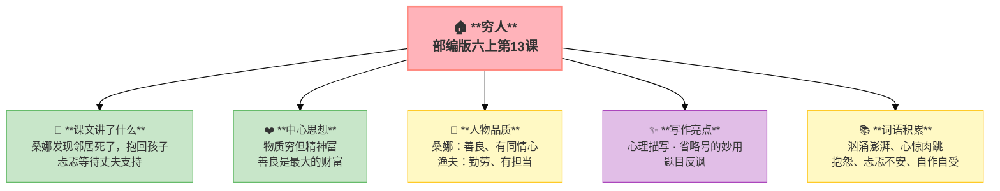

---
tags:
  - 六上
  - 语文
  - 小说
  - 叙事
  - 人物
  - 穷人
---

# 第13课 穷人

> 部编版六上第4单元 · 小说
> **阅读重点**：读小说，关注情节、环境、人物形象
> **习作目标**：笔尖流出的故事（创编小说）

---

## 📖 课文讲了什么

| 核心问题 | 主要内容 |
|:---------|:---------|
| 桑娜做了什么选择？结果如何？ | 发现邻居死了→抱回孩子→忐忑等待→丈夫支持 |

**一句话速览**：桑娜的丈夫出海打鱼还没回来，她发现邻居西蒙死了——留下了两个孩子。桑娜把两个孩子抱回了自己家。她忐忑不安：丈夫会同意吗？丈夫回来后，两人沉默了很久。最后丈夫说："快去把他们抱来。"



---

## ❤️ 中心思想

**物质穷但精神富——善良是最大的财富。真正的"穷人"是有物质却无情的人。**

---

## 📜 知背景

- 作者：**列夫·托尔斯泰**（俄国作家）
- 代表作：《战争与和平》《安娜·卡列尼娜》《复活》

---

## 📝 生字

（本课无重点生字）

---

## 🔤 多音字

（本课无重点多音字）

---

## 📚 词语积累

| 词语 | 解释 |
|:----|:-----|
| **汹涌澎湃** | 水势浩大的样子 |
| **心惊肉跳** | 非常害怕 |
| **抱怨** | 埋怨 |
| **忐忑不安** | 心里七上八下 |
| **自作自受** | 自己造成的后果自己承担 |
| **熬** | 坚持（在困境中过活） |

---

## 🏗️ 文章结构：超清晰！

```
等待丈夫（桑娜焦急等待出海打鱼的丈夫）
    ↓
发现邻居（西蒙死了——留下了两个孩子）
    ↓
抱回孩子（内心忐忑不安——他会同意吗）
    ↓
丈夫归来（沉默——长时间的沉默）
    ↓
共同承担（"快去把他们抱来"——夫妻同心）
```

---

## ✨ 阅读与写作：深挖课文"宝藏"

| 写法亮点 | 课文内容 | 写作技巧 |
|:---------|:---------|:---------|
| **心理描写** | "她的心跳得很厉害……但是觉得非这样做不可" | 本能的爱——理性犹豫，感性已做 |
| **省略号的妙用** | "他会说什么呢？……是他来啦？……不，还没来！……" | 省略号和问号写出内心的煎熬 |
| **题目反讽** | 题目叫"穷人"——物质穷但精神富 | 真正的"穷人"是有物质却无情的人 |

---

## 📚 语言积累：词语库+句式库

### 句式库
- 她的心跳得很厉害，但是觉得非这样做不可。
- 他会说什么呢？……是他来啦？……不，还没来！……

---

## 📋 学习自评表

| 评价维度 | 我能…… | ⭐⭐⭐ |
|:---------|:-------|:------|
| **读** | 读出桑娜内心的矛盾 | □ |
| **找** | 找出心理描写的段落 | □ |
| **品** | 体会省略号的作用 | □ |
| **说** | 说出"穷人"的真正含义 | □ |
