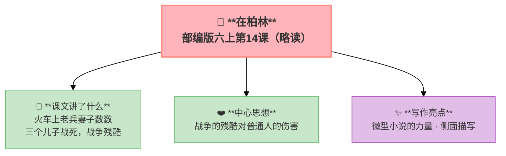

---
tags:
  - 六上
  - 语文
  - 小说
  - 叙事
  - 在柏林
---

# 第14课 在柏林（略读）

> 部编版六上第4单元 · 小说
> **阅读重点**：读小说，关注情节、环境、人物形象
> **习作目标**：笔尖流出的故事（创编小说）

---

## 📖 课文讲了什么

| 核心问题 | 主要内容 |
|:---------|:---------|
| 火车上发生了什么？老兵的妻子为什么数数？ | 三个儿子战死→妻子精神失常→战争的残酷 |

**一句话速览**：一列火车上，一个老兵和他的妻子——妻子数着"一、二、三"，因为她三个儿子都在战争中死了。周围的人一开始不理解，后来沉默了。

---

## ❤️ 中心思想

**战争的残酷对普通人的伤害——三个儿子战死，妻子精神失常。**

---

## 📝 生字

（本课无重点生字）

---

## 🔤 多音字

（本课无重点多音字）

---

## 📚 词语积累

（本课为略读课文，无重点词语）

---

## 🏗️ 文章结构：超清晰！

（微型小说——火车车厢为场景，通过对话和细节展现战争的残酷）

---

## ✨ 阅读与写作：深挖课文"宝藏"

| 写法亮点 | 课文内容 | 写作技巧 |
|:---------|:---------|:---------|
| **微型小说的力量** | 短短几百字，写出战争对普通人的伤害 | 篇幅越小，震撼越大 |
| **侧面描写** | 不写战场，写车厢 | 战争的后遗症无处不在 |

---

## 📚 语言积累：词语库+句式库

### 句式库
- 一、二、三……（妻子数数的细节）

---

## 📋 学习自评表

| 评价维度 | 我能…… | ⭐⭐⭐ |
|:---------|:-------|:------|
| **读** | 读出战争的残酷 | □ |
| **说** | 说清楚故事的来龙去脉 | □ |
| **想** | 想到战争对普通人的伤害 | □ |
