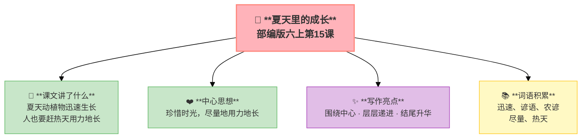

---
tags:
  - 六上
  - 语文
  - 围绕中心
  - 夏天里的成长
---

# 15 夏天里的成长

> 部编版六上第5单元 · 习作单元：围绕中心意思写
> **阅读重点**：体会文章是怎样围绕中心意思来写的
> **习作目标**：围绕中心意思写（选一个字，写一篇作文）



### 📖 课文讲了什么

夏天是万物迅速生长的季节——绿蔓、竹子、高粱、苞蕾、小猫小狗小鸡，都在飞快地长大。人也是一样，"赶热天，尽量地用力地长。"

---

### ❤️ 中心思想

**通过描写夏天里动植物的迅速生长，说明了人也要珍惜时光、赶热天尽量地长的道理。**

---

### 📜 知背景
- 作者：梁容若
- 这是一篇**议论性散文**，围绕"夏天是万物迅速生长的季节"这个中心句展开

---

### 🏗️ 文章结构：超清晰！

| 自然段 | 内容 |
|:-------|:-----|
| 中心句 | 夏天是万物迅速生长的季节 |
| 第1段 | 动植物在长（绿蔓→竹子→高粱→苞蕾→小猫小狗） |
| 第2段 | 事物在长（土地→河流→铁轨） |
| 第3段 | 人也要长（赶热天，尽量地用力地长） |

```
中心句：夏天是万物迅速生长的季节
    ↓
动植物在长（绿蔓→竹子→高粱→苞蕾→小猫小狗）
    ↓
事物在长（土地→河流→铁轨）
    ↓
人也要长（赶热天，尽量地用力地长）
```

---

### 📚 词语积累

**必会字词**

| 词语 | 解释 |
|:----|:-----|
| **迅速** | 速度很快 |
| **谚语** | 民间流传的俗语 |
| **农谚** | 关于农业的谚语 |
| **尽量** | 尽可能 |
| **热天** | 大热天（比喻青春时期） |

---

### ✨ 阅读与写作：深挖课文"宝藏"

| 写法亮点 | 课文内容 | 写作技巧 |
|:---------|:---------|:---------|
| **围绕中心** | 每一段都扣住"长"字 | 中心句统领全篇 |
| **层层递进** | 动植物→事物→人 | 从大自然到人，范围逐步扩大 |
| **结尾升华** | "人也是一样，要赶热天，尽量地用力地长" | 由物及人，点明主题 |

---

### 📋 学习自评表（教-学-评一致性）✅

| 评价维度 | 我能…… | ⭐⭐⭐ |
|:---------|:-------|:------|
| **读** | 读出夏天万物生长之势 | □ |
| **找** | 找出全文的中心句 | □ |
| **说** | 说出文章围绕"长"写了哪几个方面 | □ |
| **写** | 学写围绕中心意思的段落 | □ |

---

## ✍️ 附：习作——围绕中心意思写

### 🎯 目标
选择一个汉字（暖/泪/变/忙/爱/乐/悔……），围绕这个字的意思写一篇作文——**每一个部分都要为中心服务。**

### 📐 写作框架

1. **开头点题**：直接说出中心
2. **事例1**（详写——最能体现中心的事）
3. **事例2**（略写——辅助说明）
4. **结尾升华**：再次点题

### 📝 范文

> **暖**
>
> "暖"是什么？是冬天的太阳，是棉被的温度，更是人心里的感动。
>
> 那是一个寒冷的冬夜。我发烧了，妈妈背我去医院。我趴在她背上，看到她的头发上全是汗——屋外零下五度，妈妈却出汗了。她一路小跑，气喘吁吁。我说："妈你放我下来吧。"她说："不用，马上到了。"那一刻，我的眼眶湿了。
>
> 到了医院，医生说需要打针。我最怕打针，别过头不敢看。妈妈握紧我的手："别怕，妈妈在。"她的手很暖，让我安心。
>
> 回到家，妈妈给我煮了姜汤。我坐在床上，捧着热乎乎的碗，看着妈妈忙前忙后的身影。窗外寒风呼啸，我的心里却像点了一团火。
>
> "暖"不只是一种温度，更是一种被爱的感觉。

### ⚠️ 常见问题
1. ❌ 选的字太大（比如"爱"太宽泛） → ✅ 选具体的、好写的
2. ❌ 多个中心 → ✅ 全篇只围绕一个字
3. ❌ 中心不明 → ✅ 开头和结尾都要点题

### 📝 范文二

> **乐**
>
> "乐"是什么？是哈哈大笑，是手舞足蹈，更是心里美滋滋的感觉。
>
> 对我来说，最大的"乐"来自帮助别人。
>
> 上学期，班里来了一个新同学——小刚。他说话口音很重，第一次自我介绍的时候，全班都笑了。他红着脸坐下了。
>
> 下课了，同学们三三两两地聊天、玩游戏。只有小刚一个人坐在座位上，翻着课本。我看出他的尴尬——我想起自己转学时的感受。我走过去，拍了拍他的肩膀："走，一起去打球！"
>
> 他抬起头，眼睛亮了一下。我们一起去操场打了球。虽然他球技不好，但我们聊得很开心。他说他老家在湖南，刚来这座城市，一个朋友都没有。
>
> 从那以后，我每天主动找他一起吃饭、一起放学。慢慢地，他融入了班集体，交到了更多朋友。有一次他用家乡话跟我说："谢谢你。"虽然我没完全听懂，但我从他的笑容中读懂了那份真诚。
>
> 那天晚上我躺在床上想：帮助别人的快乐，和吃零食、看电视的快乐不一样。那种快乐会一直在心里，不会消失。
>
> "乐"有很多种——而最甜的"乐"，是让别人笑。

### 🧠 写作指导

**① 从阅读中学写作（申怡·读写结合）**
回到本单元的课文，看看作者是怎么写的——
- 《夏天里的成长》：从这篇可以学到**从不同方面写同一个中心——动植物在长、事物在长、人也在长，层层递进**
- 《盼》：从这篇可以学到**用具体事例表现中心——蕾蕾想穿雨衣，每一个动作、每一句对话都围绕"盼"字展开**
→ 把这些方法用到你的作文里，语文课本就是最好的"作文书"。

**② 先搭架子再动笔（申怡·理科思维）**
动笔之前，先回答三个问题：
1. 我选哪个字作为中心？
2. 我准备用几个事例来表现这个字？每个事例写什么？
3. 开头怎样点题？结尾怎样再次点题？
列一个简单的提纲，就像盖房子先搭钢筋一样。框架稳了，文章就稳了。

**③ 说人话，说真话（温儒敏·回到常识）**
不要堆砌好词好句。把一件小事写清楚，比写一篇"漂亮"的空话强一百倍。写你自己真正看到、听到、感受到的——这样的文章，读起来才有温度。

---

## 📎 拓展
- 交流平台：围绕中心选材的方法
