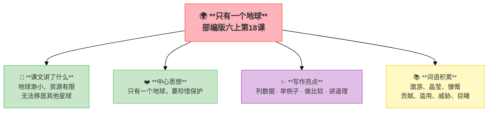

---
tags:
  - 六上
  - 语文
  - 保护环境
  - 只有一个地球
---

# 18 只有一个地球

> 部编版六上第6单元 · 保护环境
> **阅读重点**：抓住关键句，把握文章的主要观点
> **习作目标**：学写倡议书（应用文）

### 📖 课文讲了什么

地球是人类的母亲——但她太渺小了，自然资源是有限的。人类无法移居到其他星球（至少目前不能）。所以，"只有一个地球"。

---

### ❤️ 中心思想

**呼吁人类珍惜地球、保护地球，因为只有一个地球。**

---

### 🏗️ 文章结构：超清晰！

| 自然段 | 内容 |
|:-------|:-----|
| 第1段 | 地球美丽而渺小 |
| 第2段 | 地球资源有限 |
| 第3段 | 人类无法移居其他星球 |
| 第4段 | 呼吁保护地球 |

---

### 📚 词语积累

**必会字词**

| 词语 | 解释 |
|:----|:-----|
| **遨游** | 漫游 |
| **晶莹** | 光亮透明 |
| **慷慨** | 大方、不吝惜 |
| **贡献** | 付出 |
| **滥用** | 胡乱使用 |
| **威胁** | 逼迫、恐吓 |
| **目睹** | 亲眼看到 |

**关键句**
> "只有一个地球。"

全文的**中心论点**——前面讲地球的美、资源的有限、不能移民——全部为这个结论服务。

**论证方法**
1. **列数据**：地球面积、资源数量
2. **举例子**：水资源、森林资源、矿产资源
3. **做比较**：地球与其他星球比较
4. **讲道理**：为什么不能移民

---

### ✨ 阅读与写作：深挖课文"宝藏"

| 写法亮点 | 课文内容 | 写作技巧 |
|:---------|:---------|:---------|
| **列数据** | 地球面积、资源数量 | 用数字说明问题，增强说服力 |
| **举例子** | 水资源、森林资源、矿产资源 | 具体事例让读者信服 |
| **做比较** | 地球与其他星球比较 | 突出地球的独特性 |
| **讲道理** | 为什么不能移民 | 逻辑严密，层层推进 |

---

### 📋 学习自评表（教-学-评一致性）✅

| 评价维度 | 我能…… | ⭐⭐⭐ |
|:---------|:-------|:------|
| **读** | 读出文章的紧迫感 | □ |
| **找** | 找出文章的关键句 | □ |
| **说** | 说出地球面临的三大问题 | □ |
| **写** | 学用列数据、举例子的说明方法 | □ |

---

## 📎 拓展
- 语文园地六：交流平台（抓关键句把握观点）
