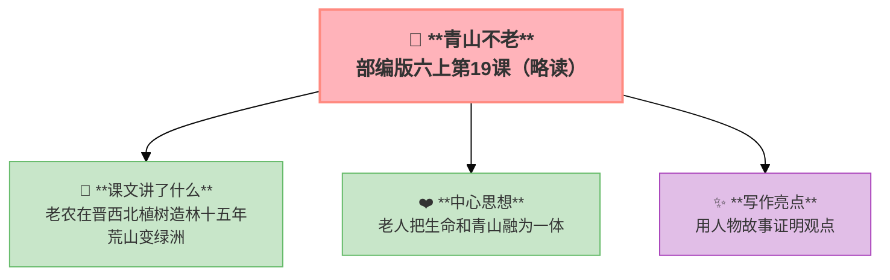

---
tags:
  - 六上
  - 语文
  - 保护环境
  - 青山不老
---

# 19 青山不老（略读）

> 部编版六上第6单元 · 保护环境
> **阅读重点**：抓住关键句，把握文章的主要观点
> **习作目标**：学写倡议书（应用文）

### 📖 课文讲了什么

一位老农在晋西北植树造林十五年——把荒山变成了绿洲。他老了，但他创造了"青山"。

**💡** 老人的价值：他把生命和青山融为一体。

---

### ❤️ 中心思想

**通过老农十五年植树造林的故事，赞美了老人无私奉献、造福后代的精神。**

---

### 🏗️ 文章结构：超清晰！

| 自然段 | 内容 |
|:-------|:-----|
| 第1段 | 晋西北的恶劣环境 |
| 第2段 | 老农的坚持和付出 |
| 第3段 | 荒山变绿洲的奇迹 |
| 第4段 | 老人的精神价值 |

---

### ✨ 阅读与写作：深挖课文"宝藏"

| 写法亮点 | 课文内容 | 写作技巧 |
|:---------|:---------|:---------|
| **用人物故事证明观点** | 老农十五年植树的事例 | 用具体事例代替空洞说教 |
| **环境对比** | 晋西北的荒凉→绿洲 | 突出老农的贡献 |
| **象征手法** | "青山不老" | 人老了，但精神永存 |

---

### 📋 学习自评表（教-学-评一致性）✅

| 评价维度 | 我能…… | ⭐⭐⭐ |
|:---------|:-------|:------|
| **读** | 默读课文，概括主要内容 | □ |
| **找** | 找出文中的关键句 | □ |
| **思** | 思考"青山不老"的含义 | □ |
| **说** | 说出老人的精神品质 | □ |

---

## 📎 拓展
- 语文园地六：交流平台（抓关键句把握观点）
