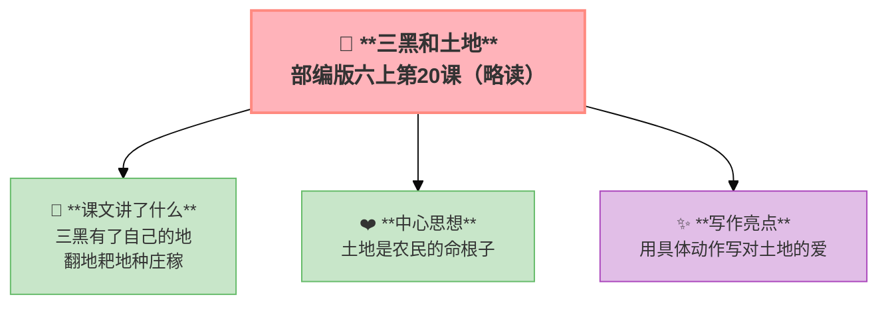

---
tags:
  - 六上
  - 语文
  - 保护环境
  - 三黑和土地
---

# 20 三黑和土地（略读）

> 部编版六上第6单元 · 保护环境
> **阅读重点**：抓住关键句，把握文章的主要观点
> **习作目标**：学写倡议书（应用文）



### 📖 课文讲了什么

三黑是个农民。土地改革后，他终于有了自己的地——他翻地、耙地、种庄稼。他对土地充满了爱惜，连一粒土都不愿浪费。

**💡** 农民和土地的关系——土地是命根子。

---

### ❤️ 中心思想

**通过三黑翻地、耙地、种庄稼的故事，表达了农民对土地的热爱和珍惜。**

---

### 🏗️ 文章结构：超清晰！

| 自然段 | 内容 |
|:-------|:-----|
| 第1段 | 三黑有了自己的土地 |
| 第2段 | 翻地、耙地的过程 |
| 第3段 | 种庄稼的希望 |
| 第4段 | 对土地的珍惜 |

---

### ✨ 阅读与写作：深挖课文"宝藏"

| 写法亮点 | 课文内容 | 写作技巧 |
|:---------|:---------|:---------|
| **用具体动作写对土地的爱** | 翻地、耙地、种庄稼 | 用动作描写代替直接抒情 |
| **细节描写** | 连一粒土都不愿浪费 | 细节见真情 |

---

### 📋 学习自评表（教-学-评一致性）✅

| 评价维度 | 我能…… | ⭐⭐⭐ |
|:---------|:-------|:------|
| **读** | 默读课文，概括主要内容 | □ |
| **找** | 找出三黑对土地的动作描写 | □ |
| **品** | 体会农民对土地的感情 | □ |
| **说** | 说出"土地是命根子"的含义 | □ |

---

## ✍️ 附：习作——学写倡议书

### 🎯 目标
针对生活中的某个问题（环保/节约/阅读/文明），写一份**倡议书**——号召大家一起行动。

### 📐 倡议书格式

```
关于______的倡议书

亲爱的______：

（背景和理由——为什么要这样做）

（具体建议——1. 2. 3. ……）

（号召语——希望大家一起行动）

倡议人：_____
日期：_____
```

### 📝 范文

> **关于节约用水的倡议书**
>
> 亲爱的同学们：
>
> 水是生命之源。我国人均水资源只有世界平均水平的四分之一，很多地方严重缺水。但在我们学校，浪费水的现象时有发生——水龙头不关紧、用水嬉戏打闹、半瓶矿泉水就扔掉……
>
> 为此，我向全校同学发出倡议：
>
> 1. 洗手打肥皂时关掉水龙头
> 2. 喝多少接多少，不浪费瓶装水
> 3. 发现水龙头没关紧，主动上前关好
> 4. 看到浪费水的行为，善意提醒
>
> 节约用水不是口号，而是行动。让我们从今天做起，从自己做起，做节水小卫士！
>
> 倡议人：六（1）班 李明
> 2025年11月15日

### ⚠️ 常见问题
1. ❌ 没有称呼和落款 → ✅ 格式要完整（称呼、倡议人、日期）
2. ❌ 建议太空泛 → ✅ 建议要具体可操作
3. ❌ 没有"为什么" → ✅ 先写背景和理由

### 📝 范文二

> **关于垃圾分类的倡议书**
>
> 亲爱的同学们：
>
> 我们每天都会产生大量垃圾——废纸、塑料瓶、剩饭剩菜……如果不分类处理，这些垃圾会污染土壤和水源，对我们的环境造成巨大伤害。其实，很多垃圾只是"放错了地方的资源"。
>
> 为了让我们的校园更美丽，为保护环境出一份力，我向大家发出以下倡议：
>
> 1. 学会垃圾分类：可回收物（纸、塑料、金属）放进蓝色垃圾桶
> 2. 厨余垃圾（剩饭、果皮）放进绿色垃圾桶
> 3. 有害垃圾（电池、过期药品）放进红色垃圾桶
> 4. 其他垃圾放进灰色垃圾桶
> 5. 在班里设置分类垃圾桶，互相监督
>
> 垃圾分类不仅是责任，更是一种文明。让我们从现在做起，从每一次扔垃圾做起，做一个环保小达人！
>
> 倡议人：六（1）班 王小红
> 2025年10月20日

### 🧠 写作指导

**① 从阅读中学写作（申怡·读写结合）**
回到本单元的课文，看看作者是怎么写的——
- 《只有一个地球》：从这篇可以学到**先摆事实再讲道理——用数据和例子说明地球的脆弱，再得出"只有一个地球"的结论**
- 《青山不老》：从这篇可以学到**用榜样人物做论据——老农十五年植树的事例，比空喊口号有说服力一百倍**
→ 把这些方法用到你的作文里，语文课本就是最好的"作文书"。

**② 先搭架子再动笔（申怡·理科思维）**
动笔之前，先回答三个问题：
1. 我的倡议书针对什么问题？
2. 背景和理由是什么（为什么要做）？
3. 具体建议有几条？每条是否可操作？
列一个简单的提纲，就像盖房子先搭钢筋一样。框架稳了，文章就稳了。

**③ 说人话，说真话（温儒敏·回到常识）**
不要堆砌好词好句。把一件小事写清楚，比写一篇"漂亮"的空话强一百倍。写你自己真正看到、听到、感受到的——这样的文章，读起来才有温度。

---

## 📎 拓展
- 语文园地六：交流平台（抓关键句把握观点）
