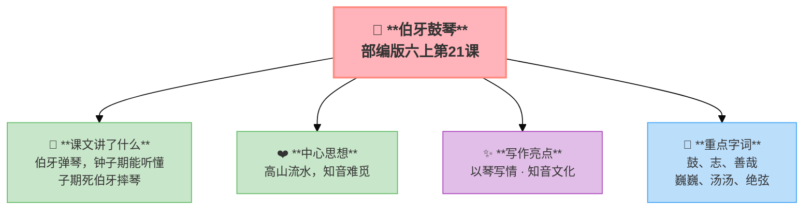
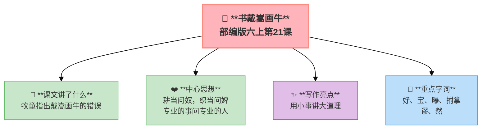

---
tags:
  - 六上
  - 语文
  - 艺术之美
  - 文言文二则
---

# 21 文言文二则

> 部编版六上第7单元 · 艺术之美
> **阅读重点**：借助语言文字展开想象，体会艺术之美
> **习作目标**：我的拿手好戏（写特长）

---

## 伯牙鼓琴

**原文**：伯牙鼓琴，钟子期听之。方鼓琴而志在太山，钟子期曰："善哉乎鼓琴，巍巍乎若太山。"少选之间而志在流水，钟子期又曰："善哉乎鼓琴，汤汤乎若流水。"钟子期死，伯牙破琴绝弦，终身不复鼓琴，以为世无足复为鼓琴者。

**翻译**：伯牙弹琴，钟子期听。伯牙心里想高山，子期说："好啊，像泰山一样巍峨！"想流水，子期说："好啊，像江河一样浩荡！"子期死后，伯牙摔了琴、断了弦，一辈子不再弹——因为世上再也没有值得为之弹琴的人了。

**💡 知音**
- 伯牙是春秋时期的著名琴师
- "高山流水"成为知音的代名词
- 摔琴 ≠ 冲动——是对知己的最高敬意

---

## 书戴嵩画牛

**原文**：蜀中有杜处士，好书画，所宝以百数。有戴嵩《牛》一轴，尤所爱，锦囊玉轴，常以自随。一日曝书画，有一牧童见之，拊掌大笑，曰："此画斗牛也。牛斗，力在角，尾搐入两股间，今乃掉尾而斗，谬矣。"处士笑而然之。

**翻译**：四川有个杜处士，最喜欢收藏书画。有一幅戴嵩画的牛最珍贵。一天晒画时，一个牧童看了拍手大笑："这画的是斗牛。牛打架时力气在角上，尾巴夹在两腿之间。这里尾巴是翘起来的——画错了。"处士笑了，承认牧童说得对。

**💡** **"耕当问奴，织当问婢"** ——专业的事要问专业的人。**艺术创作也要尊重事实。**

---

### 📚 词语积累

**伯牙鼓琴**

| 字词 | 解释 |
|:----|:-----|
| **鼓** | 弹奏 |
| **志** | 心志，心意 |
| **善哉** | 好啊 |
| **巍巍** | 高大的样子 |
| **汤汤** | 水流大而急的样子 |
| **绝弦** | 断绝琴弦 |

**书戴嵩画牛**

| 字词 | 解释 |
|:----|:-----|
| **好** | 喜好 |
| **宝** | 珍藏 |
| **曝** | 晒 |
| **拊掌** | 拍手 |
| **谬** | 错误 |
| **然** | 认为……是对的 |

---

### 词语解释

| 词语 | 画面式解释 |
|:-----|:----------|
| 鼓 | 想象一下，伯牙把双手放在琴上，轻轻拨动琴弦——"鼓"就是"弹奏"的意思 |
| 志 | 想象一下，你心里在想什么——伯牙弹琴的时候心里想着高山，这个"心里的想法"就叫"志" |
| 善哉 | 想象一下，钟子期听完一段琴，忍不住竖起大拇指说："太好了！太妙了！"——这叫"善哉" |
| 巍巍 | 想象一下，泰山又高又大立在眼前——"巍巍"就是那种高大雄伟的样子 |
| 汤汤 | 想象一下，江水浩浩荡荡地向东流去——"汤汤"就是水流又大又急的样子 |
| 绝弦 | 想象一下，伯牙把琴弦"嘣"的一声扯断了——他从此再也不弹琴了，因为懂他的人已经不在了 |
| 曝 | 想象一下，一个大晴天，杜处士把收藏的字画一幅一幅拿出来，摊在太阳底下晒——这叫"曝" |
| 拊掌 | 想象一下，牧童看到画上的错误，拍着手"哈哈哈"大笑起来——"拊掌"就是拍手 |

---

### ✨ 阅读与写作：深挖课文"宝藏"

| 文言文 | 写法亮点 | 写作技巧 |
|:-------|:---------|:---------|
| 伯牙鼓琴 | 以琴写情 | 用音乐表达知音之情 |
| 书戴嵩画牛 | 用小事讲大道理 | 牧童指出名家错误，说明实践出真知 |

---

### 📋 学习自评表（教-学-评一致性）✅

| 评价维度 | 我能…… | ⭐⭐⭐ |
|:---------|:-------|:------|
| **读** | 正确、流利地朗读文言文 | □ |
| **解** | 借助注释理解每句话的意思 | □ |
| **品** | 体会"知音"的含义 | □ |
| **用** | 用"好、宝、曝"等词语造句 | □ |

---

## 📎 拓展
- 语文园地七：交流平台（借助想象体会艺术之美）
