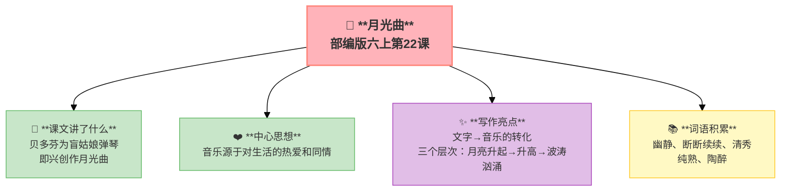

---
tags:
  - 六上
  - 语文
  - 艺术之美
  - 月光曲
---

# 22 月光曲

> 部编版六上第7单元 · 艺术之美
> **阅读重点**：借助语言文字展开想象，体会艺术之美
> **习作目标**：我的拿手好戏（写特长）

### 📖 课文讲了什么

贝多芬在莱茵河边散步，听到一间茅屋里传出钢琴声——一个盲姑娘在弹他的曲子。贝多芬走进去，为她弹了一首又一首。盲姑娘说："弹得多纯熟啊！感情多深啊！"贝多芬被感动了——月光下，他即兴创作了《月光曲》。

---

### ❤️ 中心思想

**通过贝多芬为盲姑娘弹琴并创作月光曲的故事，表现了音乐家对穷苦人民的同情和对音乐的热爱。**

---

### 🏗️ 文章结构：超清晰！

| 自然段 | 内容 |
|:-------|:-----|
| 第1段 | 贝多芬散步，听到琴声 |
| 第2段 | 进茅屋，为盲姑娘弹琴 |
| 第3段 | 盲姑娘的感动和赞叹 |
| 第4段 | 月光下即兴创作月光曲 |
| 第5段 | 传说的由来 |

---

### 📚 词语积累

**必会字词**

| 词语 | 解释 |
|:----|:-----|
| **幽静** | 幽雅安静 |
| **断断续续** | 时断时续 |
| **清秀** | 美丽不俗 |
| **纯熟** | 非常熟练 |
| **陶醉** | 沉浸在美好的境界中 |

**💡 文字→音乐的转化**

> "他好像面对着大海，月亮正从水天相接的地方升起来。微波粼粼的海面上，霎时间洒满了银光。月亮越升越高，穿过一缕一缕轻纱似的微云。忽然，海面上刮起了大风，卷起了巨浪。被月光照得雪亮的浪花，一个连一个朝着岸边涌过来……"

**三个层次**：月亮升起（平缓）→月亮升高（柔和）→海面波涛汹涌（激昂）

**这是《月光曲》的旋律——用文字写出音乐。**

---

### ✨ 阅读与写作：深挖课文"宝藏"

| 写法亮点 | 课文内容 | 写作技巧 |
|:---------|:---------|:---------|
| **文字→音乐的转化** | 用海面景象描写旋律变化 | 把看不见的声音转化成看得见的画面 |
| **三个层次** | 月亮升起→升高→波涛汹涌 | 用递进结构表现音乐的情绪变化 |
| **虚实结合** | 贝多芬弹琴（实）→传说（虚） | 增加故事的传奇色彩 |

---

### 📋 学习自评表（教-学-评一致性）✅

| 评价维度 | 我能…… | ⭐⭐⭐ |
|:---------|:-------|:------|
| **读** | 有感情地朗读课文 | □ |
| **想** | 借助语言文字想象月光曲的画面 | □ |
| **品** | 品味贝多芬的创作灵感来源 | □ |
| **写** | 学习用文字描写音乐的方法 | □ |

---

## 📎 拓展
- 语文园地七：交流平台（借助想象体会艺术之美）
