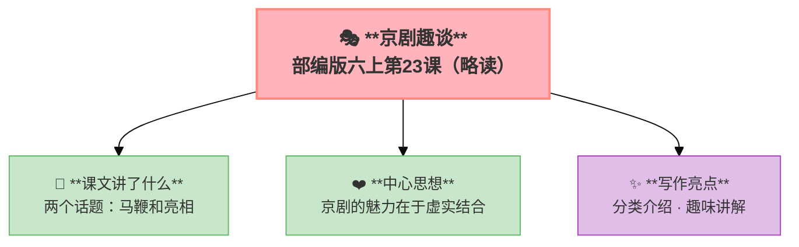

---
tags:
  - 六上
  - 语文
  - 艺术之美
  - 京剧趣谈
---

# 23 京剧趣谈（略读）

> 部编版六上第7单元 · 艺术之美
> **阅读重点**：借助语言文字展开想象，体会艺术之美
> **习作目标**：我的拿手好戏（写特长）

### 📖 课文讲了什么

两个话题——"马鞭"和"亮相"。

- **马鞭**：京剧里用一根马鞭代表骑马——观众能接受，因为这是"虚拟"的艺术
- **亮相**：人物出场时静止不动——是一种"亮相"的艺术效果

**💡** 京剧的魅力：**虚实结合**——明明是假的，但看起来比真的还像真的。

---

### ❤️ 中心思想

**通过介绍京剧中的"马鞭"和"亮相"两种表演手法，展现了京剧虚实结合的艺术魅力。**

---

### 🏗️ 文章结构：超清晰！

| 自然段 | 内容 |
|:-------|:-----|
| 马鞭部分 | 马鞭的由来和作用 |
| 马鞭部分 | 虚拟道具的艺术效果 |
| 亮相部分 | 亮相的定义和作用 |
| 亮相部分 | 静态亮相的艺术效果 |

---

### ✨ 阅读与写作：深挖课文"宝藏"

| 写法亮点 | 课文内容 | 写作技巧 |
|:---------|:---------|:---------|
| **分类介绍** | 马鞭、亮相两个话题 | 分点说明，条理清晰 |
| **趣味讲解** | 用通俗语言解释专业术语 | 让读者容易理解 |
| **虚实结合** | 马鞭代表骑马，亮相定格动作 | 以简代繁，以虚写实 |

---

### 📋 学习自评表（教-学-评一致性）✅

| 评价维度 | 我能…… | ⭐⭐⭐ |
|:---------|:-------|:------|
| **读** | 默读课文，了解主要内容 | □ |
| **找** | 找出"马鞭"和"亮相"的特点 | □ |
| **品** | 体会京剧"虚实结合"的魅力 | □ |
| **说** | 向别人介绍一种京剧表演手法 | □ |

---

## ✍️ 附：习作——我的拿手好戏

### 🎯 目标
写你的一项特长（做饭/画画/跳绳/魔方/弹琴），写出你是怎么练成的和展示时的精彩。

### 📐 写作框架

1. **我的拿手好戏是什么**
2. **怎么练成的**（苦练/受挫/坚持）
3. **一次精彩的展示**（众人面前露一手）
4. **我的收获**

### 📝 范文

> **我的拿手好戏——包饺子**
>
> 每个人都有自己拿手的事。我奶奶会剪窗花，我爸会修水管。我呢？我会包饺子——而且包得又快又好。
>
> 我学包饺子是从七岁开始的。那年除夕，全家一起包饺子。我好奇地拿起一张皮，学着大人的样子——结果包出来的饺子像个"大肚子"，站都站不稳。大家都笑了。爷爷说："包饺子可是门手艺，慢慢来。"
>
> 从那以后，每次包饺子我都凑上去帮忙。慢慢地，我学会了擀皮——圆的、中间厚边上薄。学会了调馅——奶奶教我要"顺时针搅拌"，让肉和菜充分融合。学会了各种包法——月牙饺、元宝饺、麦穗饺……
>
> 今年春节，我大显身手了。叔叔婶婶来做客，我主动请缨包饺子。我利索地擀皮、放馅、捏边——一个接一个，整齐地排成一排。婶婶惊讶地说："天哪，这孩子包得比我还好！"我微微一笑，心里乐开了花。
>
> 饺子出锅了。我包的每一个都站得直直的，像一个个小元宝。吃着自己包的饺子，格外香。
>
> 包饺子这件事让我明白：任何"拿手好戏"都是用时间换来的。没有捷径，只有反复练习。

### ⚠️ 常见问题
1. ❌ 写得太笼统 → ✅ 要有具体的动作细节
2. ❌ 只写"很厉害"不写"怎么厉害的" → ✅ 要有一次"展示"的具体描写
3. ❌ 没有"学习过程" → ✅ 失败→坚持→成功的弧线

### 📝 范文二

> **我的拿手好戏——玩魔方**
>
> 要说我的拿手好戏，那非魔方莫属了。六面魔方，我能在40秒内复原。
>
> 一开始我对魔方一窍不通。三年级的时候，我看到表哥三下五除二就把一个打乱的魔方复原了，羡慕得不得了。表哥教了我一个口诀："上左下右，上右下左"——我背了整整一个星期。
>
> 刚开始练的时候，我转一个面要看好久，经常转到一半就忘了下一步。有时候好不容易拼好两层，最后一层又搞砸了。我气得把魔方摔在沙发上——但冷静下来又捡起来继续练。
>
> 渐渐地，我的手指越来越灵活。从五分钟到三分钟，从三分钟到一分钟……每一次进步都让我兴奋不已。我还在网上学了更高级的CFOP公式，速度越来越快。
>
> 最"风光"的一次是在学校才艺展示上。我带着魔方上了台，台下的同学一片起哄："魔方也叫才艺？"我没说话，把魔方打乱，然后开始复原——手指飞快地转动，啪啪啪的声音像雨点一样。不到40秒，六面全部还原。台下安静了两秒，然后爆发出热烈的掌声和惊呼声："太牛了吧！"
>
> 玩魔方让我明白了一个道理：任何看起来炫酷的技能，背后都是无数次的练习。所谓"拿手好戏"，不过是"熟能生巧"四个字。

### 🧠 写作指导

**① 从阅读中学写作（申怡·读写结合）**
回到本单元的课文，看看作者是怎么写的——
- 《伯牙鼓琴》：从这篇可以学到**知音知己的默契——真正的"拿手好戏"背后，是对这件事的热爱和投入**
- 《月光曲》：从这篇可以学到**用文字描写音乐——把看不见的声音转化成看得见的画面（月亮升起→海面波涛）**
→ 把这些方法用到你的作文里，语文课本就是最好的"作文书"。

**② 先搭架子再动笔（申怡·理科思维）**
动笔之前，先回答三个问题：
1. 我的拿手好戏是什么？
2. 我是怎么练成的？（遇到了什么困难？怎么克服的？）
3. 哪一次展示最精彩？当时发生了什么？
列一个简单的提纲，就像盖房子先搭钢筋一样。框架稳了，文章就稳了。

**③ 说人话，说真话（温儒敏·回到常识）**
不要堆砌好词好句。把一件小事写清楚，比写一篇"漂亮"的空话强一百倍。写你自己真正看到、听到、感受到的——这样的文章，读起来才有温度。

---

## 📎 拓展
- 语文园地七：交流平台（借助想象体会艺术之美）
