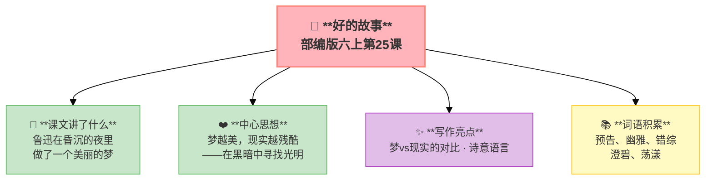

---
tags:
  - 六上
  - 语文
  - 走近鲁迅
  - 好的故事
---

# 25 好的故事

> 部编版六上第8单元 · 走近鲁迅
> **阅读重点**：借助相关资料，理解课文主要内容
> **习作目标**：有你，真好（抒情叙事）

### 📖 课文讲了什么

鲁迅在昏沉的夜里做了一个梦——梦里是一条小船，在水中前行。两岸的风景倒映在水中——各种颜色交织、各种人物活动。这是一个"好的故事"——美丽、幽雅、有趣。但梦醒了，只剩下一张纸。

---

### ❤️ 中心思想

**梦越美，现实越残酷。鲁迅在黑暗中寻找光明，表达了对美好生活的向往。**

---

### 🏗️ 文章结构：超清晰！

| 自然段 | 内容 |
|:-------|:-----|
| 第1段 | 昏沉的夜，鲁迅困倦 |
| 第2-4段 | 入梦，小船在水中前行 |
| 第5-7段 | 梦中的美景——颜色、人物、活动 |
| 第8-9段 | 梦醒，美好的故事消散 |

---

### 📚 词语积累

**必会字词**

| 词语 | 解释 |
|:----|:-----|
| **预告** | 事先通知 |
| **幽雅** | 幽静雅致 |
| **错综** | 交叉复杂 |
| **澄碧** | 清澈碧蓝 |
| **荡漾** | 水波晃动 |

**💡 梦 vs 现实**
- 梦里："好的故事"——美丽、自由、多彩
- 现实：昏沉的夜——压抑、黑暗

**梦越美，现实越残酷。** 鲁迅在黑暗中寻找光明。

---

### ✨ 阅读与写作：深挖课文"宝藏"

| 写法亮点 | 课文内容 | 写作技巧 |
|:---------|:---------|:---------|
| **梦vs现实的对比** | 梦中的美丽 vs 现实的黑暗 | 用对比突出主题 |
| **诗意语言** | "云锦""红色""绿色"等色彩描写 | 用诗意的语言营造意境 |
| **象征手法** | "好的故事"象征理想生活 | 以梦写现实，含蓄深刻 |

---

### 📋 学习自评表（教-学-评一致性）✅

| 评价维度 | 我能…… | ⭐⭐⭐ |
|:---------|:-------|:------|
| **读** | 默读课文，感受诗意语言 | □ |
| **找** | 找出梦中和现实的对比 | □ |
| **品** | 品味"好的故事"的象征意义 | □ |
| **说** | 说出鲁迅在黑暗中寻找光明的含义 | □ |

---

## 📎 拓展
- 语文园地八：交流平台（借助资料理解鲁迅）
- 推荐阅读：《朝花夕拾》
