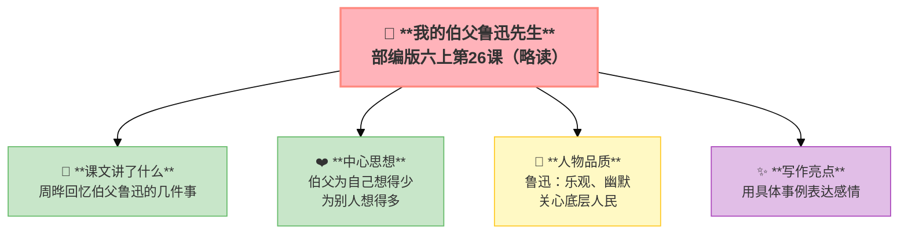

---
tags:
  - 六上
  - 语文
  - 走近鲁迅
  - 我的伯父鲁迅先生
---

# 26 我的伯父鲁迅先生（略读）

> 部编版六上第8单元 · 走近鲁迅
> **阅读重点**：借助相关资料，理解课文主要内容
> **习作目标**：有你，真好（抒情叙事）

### 📖 课文讲了什么

鲁迅的侄女周晔回忆伯父的几件事：伯父谈《水浒》→伯父说"碰壁"→伯父救助车夫→伯父关心女佣阿三。

**💡** 别人眼中的鲁迅——乐观、幽默、关心底层人民。

> "伯父就是这样的一个人，他为自己想得少，为别人想得多。"

---

### ❤️ 中心思想

**通过周晔回忆伯父鲁迅的几件事，表现了鲁迅先生为自己想得少、为别人想得多的高尚品质。**

---

### 👤 人物品质

**鲁迅**：乐观、幽默、关心底层人民、为自己想得少、为别人想得多

---

### 🏗️ 文章结构：超清晰！

| 自然段 | 内容 |
|:-------|:-----|
| 第1段 | 伯父去世了，很多人来追悼 |
| 第2-3段 | 伯父谈《水浒》——启发"我"读书 |
| 第4段 | 伯父说"碰壁"——幽默面对困难 |
| 第5-7段 | 伯父救助车夫——关心穷苦人 |
| 第8-9段 | 伯父关心女佣阿三——为自己想得少 |

---

### ✨ 阅读与写作：深挖课文"宝藏"

| 写法亮点 | 课文内容 | 写作技巧 |
|:---------|:---------|:---------|
| **用具体事例表达感情** | 谈《水浒》、说"碰壁"、救助车夫、关心阿三 | 每件事都体现了伯父的品质 |
| **以小见大** | 从日常小事看鲁迅的伟大 | 不说空话，用事实说话 |
| **首尾呼应** | 开头写追悼，结尾写感悟 | 结构完整，情感真挚 |

---

### 📋 学习自评表（教-学-评一致性）✅

| 评价维度 | 我能…… | ⭐⭐⭐ |
|:---------|:-------|:------|
| **读** | 默读课文，概括主要事件 | □ |
| **找** | 找出鲁迅先生的几件事 | □ |
| **品** | 品味"碰壁"的双关含义 | □ |
| **说** | 说出鲁迅先生的高尚品质 | □ |

---

## 📎 拓展
- 语文园地八：交流平台（借助资料理解鲁迅）
- 推荐阅读：《朝花夕拾》
