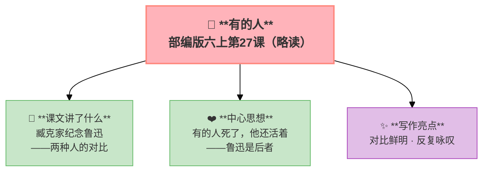

---
tags:
  - 六上
  - 语文
  - 走近鲁迅
  - 有的人
---

# 27 有的人（略读）

> 部编版六上第8单元 · 走近鲁迅
> **阅读重点**：借助相关资料，理解课文主要内容
> **习作目标**：有你，真好（抒情叙事）

> 有的人活着，他已经死了；
> 有的人死了，他还活着。

**作者**：臧克家（纪念鲁迅逝世十三周年）

**💡** 两种人：骑在人民头上的和俯下身子给人民当牛马的——鲁迅是后者。

---

### ❤️ 中心思想

**通过对比两种人——骑在人民头上的和俯下身子给人民当牛马的——赞美了鲁迅先生为人民服务的精神。**

---

### 🏗️ 文章结构：超清晰！

| 自然段 | 内容 |
|:-------|:-----|
| 第1-2节 | 有的人活着却死了，有的人死了却活着 |
| 第3-4节 | 骑在人民头上的 vs 俯下身子给人民当牛马的 |
| 第5-6节 | 愿做野草的 vs 愿做不朽的 |
| 第7节 | 呼应开头，点明主题 |

---

### ✨ 阅读与写作：深挖课文"宝藏"

| 写法亮点 | 课文内容 | 写作技巧 |
|:---------|:---------|:---------|
| **对比鲜明** | 两种人的对比 | 用对比突出主题 |
| **反复咏叹** | "有的人"反复出现 | 增强诗歌的节奏感和感染力 |
| **象征手法** | "野草"象征奉献精神 | 以物喻人，含蓄深刻 |

---

### 📋 学习自评表（教-学-评一致性）✅

| 评价维度 | 我能…… | ⭐⭐⭐ |
|:---------|:-------|:------|
| **读** | 有感情地朗读诗歌 | □ |
| **找** | 找出两种人的对比 | □ |
| **品** | 品味"有的人死了，他还活着"的含义 | □ |
| **说** | 说出鲁迅先生的精神品质 | □ |

---

## ✍️ 附：习作——有你，真好

### 🎯 目标
写一个人——他/她让你感到"有你，真好"。可以写亲人、老师、朋友，甚至陌生人。

### 📐 写作框架

1. **引**：这个人是谁 + "有你，真好"的总体感受
2. **一件具体的事**（详写——最能体现"好"的事）
3. **细节描写**（当时的动作/语言/神情）
4. **你的感受**（内心的温暖/感动）
5. **再次点题**：有你，真好

### 📝 范文

> **有你，真好**
>
> 妈妈，在这个世界上，我最想对一个人说：有你，真好。
>
> 那个冬天，我期中考试考砸了。数学只有73分，是我有史以来最差的成绩。我拿着试卷回到家，一句话也不想说。
>
> 妈妈一眼就看出来了。她没有问我的分数，而是默默地给我倒了一杯热水。"先喝点水，暖和暖和。"她的声音很轻，像什么事都没发生一样。
>
> 过了一会儿，我还是忍不住哭了。妈妈走过来，把我搂在怀里。"没关系的，"她说，"一次考不好不代表什么。妈妈相信你。"她轻轻拍着我的背，就像我小时候那样。
>
> 她陪我分析了试卷上的错题，一道一道讲给我听。她的声音一直很温柔，没有一句责备。那天晚上，我躺在床上想：如果妈妈骂我一顿，我可能反而会好受些。她什么都没说，却在夜里帮我整理了一份复习计划放在桌上。
>
> 第二天醒来，看着那份工工整整的复习计划，我的鼻子又酸了。
>
> 妈妈，你的爱总是这么安静。你的怀抱是我的避风港，你的信任让我有勇气面对挫折。有你，真好。

### ⚠️ 常见问题
1. ❌ 写得太假大空 → ✅ 用一件小事来证明
2. ❌ 只有"他做了什么"没有"我的感受" → ✅ 写出内心受到的触动
3. ❌ 没有具体细节 → ✅ 描写当时的细节（动作/语言/表情）

### 📝 范文二

> **有你，真好**
>
> 李老师，虽然您只教了我一年，但我想对您说：有你，真好。
>
> 我是一个特别胆小的人——上课不敢举手，回答问题声音像蚊子叫，连走路都低着头。同学们叫我"含羞草"。
>
> 那天的语文课上，您提了一个问题："谁能说说这篇课文的中心思想？"我知道答案——我在预习时认真想过。我的手在桌面上抬了抬，又放下了。我害怕说错，害怕被嘲笑。
>
> "小军？"您竟然叫了我的名字。我愣住了，慢慢地站起来，感觉全班四十双眼睛都在看我。我的脑子一片空白。
>
> "别着急，慢慢说。"您微笑着看我，眼神里没有催促，只有鼓励。
>
> 我深吸一口气，说出了我的答案。虽然声音很小，但您听到了。您点了点头，说："说得非常好！小军同学的思考很深入，大家给他鼓掌！"
>
> 掌声响起来的那一刻，我的眼眶热了。那是我第一次在全班面前被表扬。
>
> 从那以后，我变了——我开始敢于举手，敢于表达自己的想法。同学说我像变了一个人。其实，我只是遇到了一个愿意等我的老师。
>
> 李老师，您的那次点名，改变了我的整个小学生活。有你，真好。

### 🧠 写作指导

**① 从阅读中学写作（申怡·读写结合）**
回到本单元的课文，看看作者是怎么写的——
- 《少年闰土》：从这篇可以学到**用典型画面写人——"深蓝的天空、金黄的圆月、项带银圈的少年"——一个画面就把闰土写活了**
- 《我的伯父鲁迅先生》：从这篇可以学到**用具体事例表达感情——谈《水浒》、说"碰壁"、救助车夫——每件事都体现了伯父的品质**
→ 把这些方法用到你的作文里，语文课本就是最好的"作文书"。

**② 先搭架子再动笔（申怡·理科思维）**
动笔之前，先回答三个问题：
1. 我要写给谁？他/她让我感到"有你，真好"的原因是什么？
2. 哪一件具体的事最能体现这种"好"？
3. 这件事中，有哪些细节（动作/语言/神情）可以写？
列一个简单的提纲，就像盖房子先搭钢筋一样。框架稳了，文章就稳了。

**③ 说人话，说真话（温儒敏·回到常识）**
不要堆砌好词好句。把一件小事写清楚，比写一篇"漂亮"的空话强一百倍。写你自己真正看到、听到、感受到的——这样的文章，读起来才有温度。

---

## 📎 拓展
- 语文园地八：交流平台（借助资料理解鲁迅）
- 推荐阅读：《朝花夕拾》
